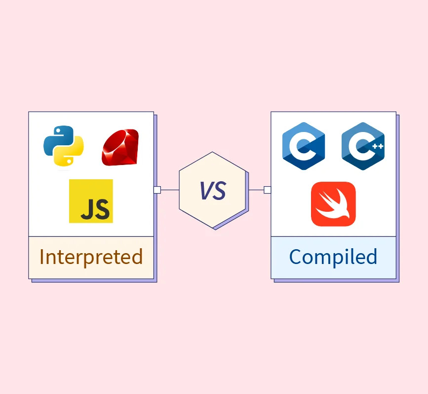

# Welcome to the Python101 Course

We’re excited to have you join us. This course is designed to give you a strong, practical foundation in Python programming, with a focus on real-world development practices and tools commonly used in industry and research.

---

## Why You Are Receiving This File

Due to limited lecture time, we are sharing this document **before the first lecture** so you can prepare your environment in advance.
Having everything set up ahead of time allows us to focus on learning Python concepts and writing code together, rather than spending valuable class time on technical setup.

---

## Python Interpreter (Required)

You need a Python Interpreter to run Python programs

* [**How to install Python (Windows)**](https://youtu.be/gmDB2iZMwAQ?si=-Umq19pa2BLthfMm)
* [**Download Python 3.14 (Windows)**](https://www.python.org/downloads/windows/)

* [**How to install Python (MacOS)**](https://www.youtube.com/watch?time_continue=96&v=jDTgmMlDSKg)
* [**Download Python 3.14 (MacOS)**](https://www.python.org/downloads/macos/)

---

## JetBrains Student Account (Recommended)

You are encouraged to create a **JetBrains Student Account** (free for students).

**Why?**
JetBrains tools (including PyCharm Professional) provide:

* Powerful code completion and refactoring
* Excellent debugging tools
* Integrated support for testing, Git, and virtual environments

Creating an account is **optional**, but it will significantly improve your development experience during this course.

[**Create Jetbrains account**](https://sales.jetbrains.com/hc/en-gb/articles/207737419-Create-a-JetBrains-Account)

---

## IDE Setup: PyCharm (Recommended)

For this course, **PyCharm Professional Edition** is the primary IDE.

* The course material, demonstrations, and workflows are **heavily based on PyCharm and JetBrains tools**
* Step-by-step setup instructions will be shared with you
* Please make sure PyCharm is installed and starts correctly before the first lecture

> You may use another IDE (such as VS Code) if you strongly prefer, but note that:
>
> * Support during lectures will focus on PyCharm
> * Some features and workflows may differ

[**Install Pycharm (Windows)**](https://youtu.be/Tmu_fkFwIvw?si=wE1-GmXCP9jiowxy)
[**Install Pycharm (MacOS)**](https://youtu.be/ZVjQFjOI49c?si=HfekgYiJn-ZBDYh4)
[**Download Pycharm**](https://www.jetbrains.com/help/pycharm/installation-guide.html)

---

## GitHub Account (Required)

You need a **GitHub account** to:

* Access course materials
* Download example code and assignments
* Share and submit your work (when required)

Please make sure you can log in successfully before the first lecture.

[**Create GitHub Account**](https://github.com/signup)

---

## Before the First Lecture

Please read the section below for:

* An introduction to the Python programming language
* An explanation of programming and programming languages
* Different programming languages
* Features and limitations of the Python programming language

---

### 1. What is Programming?

Programming is the process of giving instructions to a computer so that it can perform specific tasks. These instructions are written in a logical and step-by-step manner to solve a problem. Programming helps humans communicate with computers effectively. It involves analyzing a problem, designing a solution, and then implementing it using code. Computers cannot work on their own without programs. Programming is used to create software, websites, mobile applications, and games. It also plays an important role in science, education, healthcare, and business. Programming requires logical thinking and creativity. Learning programming helps develop problem-solving and analytical skills.

---

### 2. What is a Programming Language?

A programming language is a formal language used to write instructions for a computer. It allows humans to communicate with computers in a way that they can understand.

---

### 3. What is a Compiled Language?

A compiled language is a programming language in which the entire program is translated into machine code before execution. This translation is done by a compiler.

---

### 4. What is an Interpreted Language?

An interpreted language is a programming language that is executed line by line. It uses an interpreter to translate and run the code during execution. The program is not converted into machine code beforehand. Interpreted languages are usually slower than compiled languages.

---

### 5. Difference Between Compiled and Interpreted Languages

| Feature                           | Compiled Language                    | Interpreted Language                            |
|-----------------------------------|--------------------------------------|-------------------------------------------------|
| **Translation method**            | Entire program is translated at once | Program is translated line by line              |
| **Execution speed**               | Faster execution                     | Slower execution                                |
| **Error detection**               | Errors are shown after compilation   | Errors are shown one at a time during execution |
| **Source code needed at runtime** | Not needed                           | Needed                                          |
| **Portability**                   | Less portable (platform-dependent)   | More portable (platform-independent)            |
| **Memory usage**                  | Generally less at runtime            | Generally more at runtime                       |
| **Example languages**             | C, C++, Go, Rust                     | Python, JavaScript, Ruby                        |
| **Output**                        | Produces an executable file          | No separate executable file                     |

---

### 6. What is Python?

Python is a high-level, interpreted programming language. It is designed to be easy to read and simple to write, making it ideal for beginners. It supports multiple programming styles, including procedural, object-oriented, and functional programming. Python is widely used in web development, data science, artificial intelligence, and automation. It has a large standard library that provides many built-in functions. Python is one of the most popular programming languages today.

---

### 7. Advantages and Limitations of Python

| **Advantages of Python**                            | **Limitations of Python**          |
|-----------------------------------------------------|------------------------------------|
| Easy to learn and read                              | Slower execution speed             |
| Simple and clean syntax                             | Uses more memory                   |
| Large standard library                              | Not ideal for mobile apps          |
| Supports multiple paradigms (OOP, procedural, etc.) | Weak for low-level programming     |
| Platform-independent                                | Runtime errors occur               |
| Huge community support                              | Limited database performance       |
| Good for AI, ML, and data science                   | Not suitable for real-time systems |
| Rapid development and prototyping                   | Slower for high-performance tasks  |
