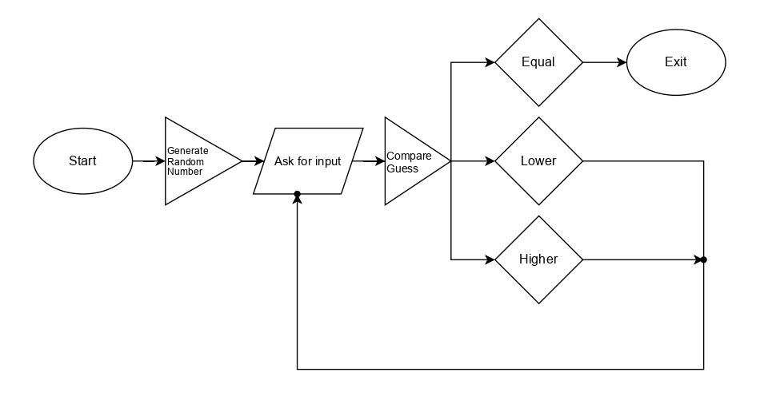

# Python101 Course

## Table of Contents

- [Hello World Project](#write-your-first-python-project)
- [Guessing Game Project](#programming-a-guessing-game)
   - [Variables and Data Types](./variables.md)
   - [Modules](./modules.md)
   - [Control Flow](./control_flow.md)

# Write Your First Python Project

---

## Step-by-Step Progress

1. First, create a project directory. For now, let’s name it **`hello_world`**.
2. Give your project some structure by creating a template directory. In this case, create a **`src/`** directory.
3. Create your main project file inside the project directory. We’ll call it **`main.py`**.
4. Write the following source code in the file:

    ```python
    if __name__ == '__main__':
        print("Hello World!")
    ```

5. Run the program to check for any errors.
6. Congratulations! You just wrote your first Python program.

---

## The Anatomy of a Python Program

Let’s break down this **“Hello, World!”** program and understand what each part does.

---

### `if __name__ == '__main__':`

- This statement tells Python to run the code inside it **only when this file is executed directly**.
- If the file is imported into another Python file, this block will **not** run.
- This pattern helps you organize code and maintain better control as your project grows.

---

### Indentation

Before understanding indentation, we need to understand **code blocks**.

> A **code block** is a group of lines that are meant to run together.

- Python uses **indentation** to define code blocks.
- Indentation controls the **execution flow** of your program.
- Lines with the same level of indentation belong to the same block.

Incorrect indentation will cause errors, so consistency is very important in Python.

---

### `print("Hello World!")`

- The `print()` function is doing all the work in this simple program.
- We pass a value (called an **argument**) to the function.
- The function then displays that value on the screen.

In this case, it prints:

```text
Hello World!
```

---

# Programming a Guessing Game

Let’s jump into Python by working through a hands-on project together!  
This exercise introduces you to several common Python concepts by showing how they are used in a real program.

You’ll learn about:

- variables
- match-case
- modules
- functions
- and more!

For now, we’ll implement a classic beginner programming problem: **a guessing game**.

## How the game workscomplex

```text
The program generates a random integer between 1 and 100.
It then prompts the player to enter a guess.
After a guess is entered, the program indicates whether the guess
is too low or too high.
If the guess is correct, the program prints a congratulatory message
and exits.
```

Now that we understand the problem statement, let’s look at how real programmers approach problems like this.

It doesn’t matter how **complex** or **simple** a problem is—before writing any code, programmers pause and think about
the problem and its solution. They do this by developing an algorithm.

This means thinking about:

* where we are now,
* where we want to go,
* what obstacles might be in the way,

and then solving those obstacles **one step at a time**.

In simple terms, programmers break a big problem into smaller, easier problems. Without doing this, you may end up
spending a lot of energy without getting the expected result.

```text
Breaking a problem into small pieces is an important programming skill
called decomposition.
Instead of solving a big problem all at once, programmers split it
into smaller, easier steps.
Each step does one simple task, which makes the program easier
to understand and maintain.
```

## How we will tackle this problem

Below is a flowchart that shows the overall logic of the guessing game:


## What is happening (step by step)

1. The program starts running.
2. It randomly chooses a number between 1 and 100.
3. The program asks the player to guess the number.
4. The player enters a guess.
5. The program checks whether the guess is:
	* lower than the secret number.
	* higher than the secret number.
	* equal to the secret number.
6. If the guess is too low or too high, the program gives feedback and asks again.
7. When the correct number is guessed, the program displays a success message and stops.

## Let's start coding

### Create project structure

1. Create a directory named ```guessing_game/```
2. Inside that directory, create another directory named ```src/```
3. Inside the ```src/``` directory, create a file called ```main.py```

Your structure should look like this:

```text
guessing_game/
└── src/
    └── main.py
```

### Write the code in ```main.py```

1. **Start with the main entry point**
   In Python, this line ensures that the code only runs when the file is executed directly:
    ```python
    if __name__ == '__main__':
        # This is where we write the code
    ```

2. **Prompt the user for input**

   Now let’s greet the user and ask them to enter a guess:
    ```python
    if __name__ == '__main__':
        print("Welcome to the Guessing Game!!!")
        guess = input("Please input your guess: ")
        print("You guessed: " + guess)
    ```
   Here:
	* `guess` is a variable that stores the user’s input.
	* `input()` always returns a string, which we’ll handle properly later.

   See [**Variables and Data Types**](./variables.md) for more details.

3. **Generate a secret number**

   Next, we need to generate a secret number that the user will try to guess.  
   The secret number should be different every time the program runs.  
   We’ll use a random number between 1 and 100.

   See [**Modules**](./modules.md) for more details.

   First, we add the line `from random import randint` to import the `randint` function from the `random` module.

   Next, we add two lines in the middle of the program. In the first line, we call the`randint(1, 100)` function,
   which generates a random number.

   Then, we assign that number to a variable called `secret_number` so we can use it later as we proceed.

    ```python
    from random import randint
     
    if __name__ == '__main__':
        print("Welcome to the Guessing Game!!!")
        guess = input("Please input your guess: ")
        secret_number = randint(1, 100)
    ```

4. **Comparing the Guess to the Secret Number**

   Now that we have both the user’s input and a randomly generated number, we can compare them to see if the guess is
   correct.

   See [**Control Flow**](./control_flow.md) for more details.

    ```python
    from random import randint
    
    if __name__ == '__main__':
        print("Welcome to the Guessing Game!!!")
        guess = input("Please input your guess: ")
        secret_number = randint(1, 100)
        
        if guess > secret_number:
            print("To big!")
        elif guess <= secret_number:
            print("To small!")
        else:
            print("You win!")
    ```

   **Question**: Does this work as we expect?

   There are several problems with the code we wrote.

	- Do you see the logic error that can occur in the second `elif` statement?
	- Can we directly compare `guess` to `secret_number`?

   #### Logic error in the conditions
        The second condition uses elif guess <= secret_number.
        Ask yourself: If the guess is exactly equal to the secret number, which condition will run?
        Because this condition includes equality (<=), the else block may never execute.

   #### Comparing different data types
        The value returned by input() is always a string, while secret_number is an integer.
        Comparing a string to an integer directly can cause an error or unexpected behavior.
        We need to make sure both values are of the same type before comparing them.

   #### Corrected Version:

   ```python
   from random import randint
   
   if __name__ == '__main__':
     print("Welcome to the Guessing Game!!!")
     guess = int(input("Please input your guess: "))
     secret_number = randint(1, 100)
     
     if guess == secret_number:
        print("You win!")
     elif guess > secret_number:
        print("To big!")
     else:
        print("To small!")
   ```
